<p align="center">
  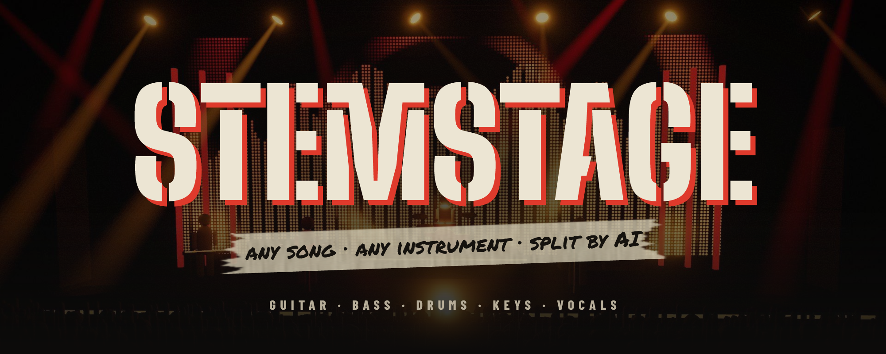
</p>

<p align="center">
  <b>The rhythm game that plays any song.</b><br/>
  Drop in a track, an AI splits it into stems, and every part becomes a playable chart — guitar, bass, drums, keys and vocals.
</p>

<p align="center">
  
  
  
  
  
  
  <a href="https://github.com/SylarBeck/STEMSTAGE/releases/latest"></a>
  <a href="LICENSE"></a>
</p>

<p align="center"><a href="https://github.com/SylarBeck/STEMSTAGE/releases/latest"><b>⬇ Download for Windows or Linux</b></a> · <a href="https://stemstage.varconstint.com/"><b>🌐 Website</b></a> · <a href="https://github.com/SylarBeck/STEMSTAGE/wiki"><b>📖 Wiki</b></a></p>

---

<p align="center">
  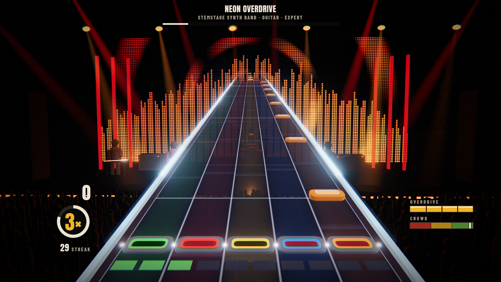
  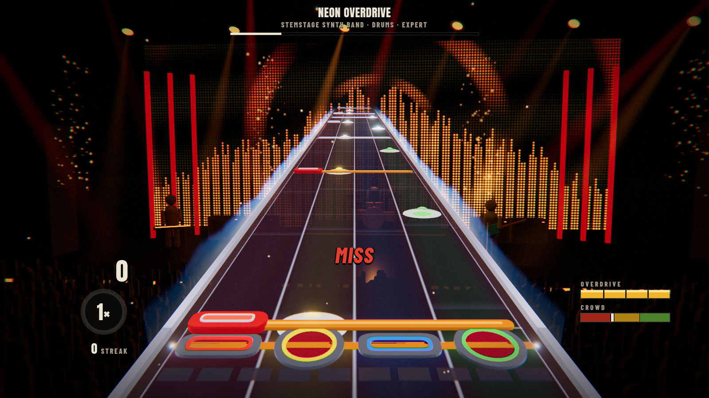
  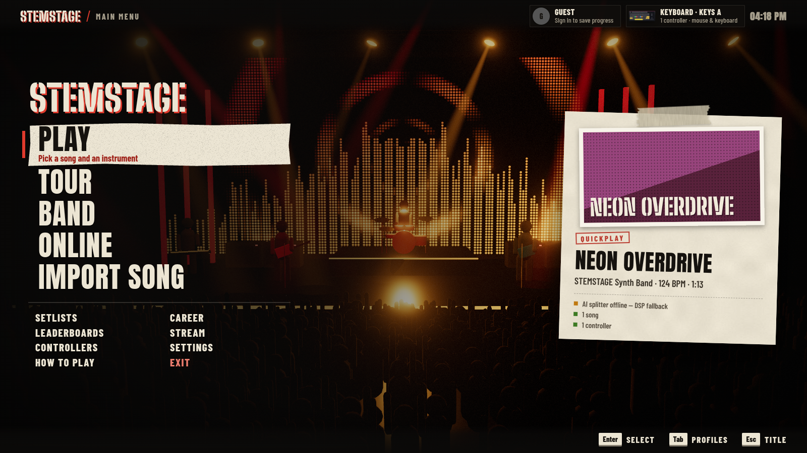
  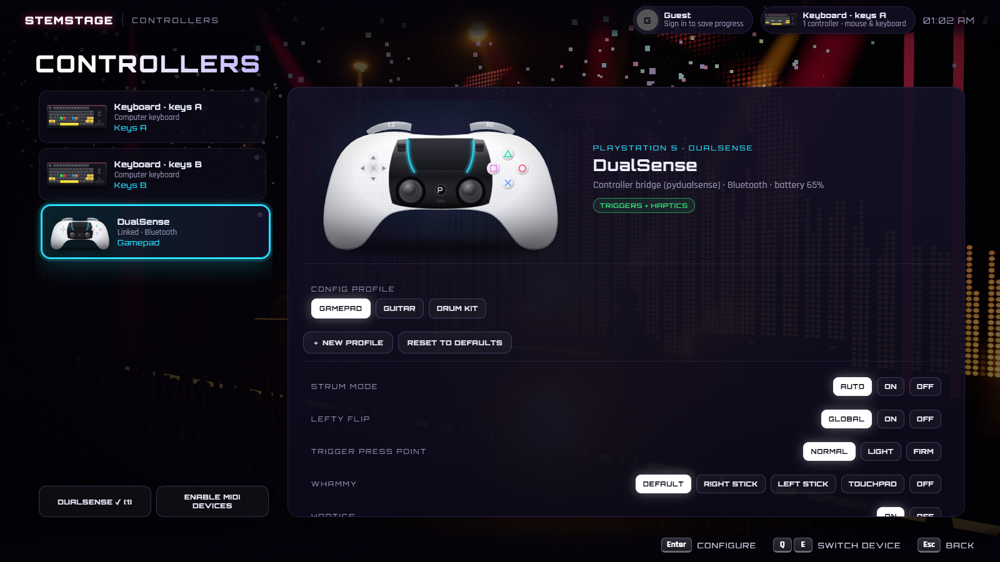
</p>

## Features

- **Any song, any part** — [Demucs](https://github.com/facebookresearch/demucs) `htdemucs_6s` separates drums, bass, guitar, piano, vocals and other on your GPU; [basic-pitch](https://github.com/spotify/basic-pitch) transcribes the notes; an auto-charter builds four difficulties with overdrive phrases.
- **Rock Band-style highway** — chrome rails that react to your state, fret smashers, glowing gems, cymbal gems on drums, a streak meter in the board, overdrive fire walls.
- **DualSense done properly** — adaptive triggers that click like frets and buzz on sustains, haptics, lightbar and player LEDs through a native [pydualsense](https://github.com/flok/pydualsense) bridge. Works over USB and Bluetooth, several controllers at once, with sub-millisecond median input lag (the bridge reads and writes on separate threads and time-stamps every press).
- **Every controller** — Xbox, DualShock 4, Switch Pro, Joy-Con, Rock Band / Guitar Hero guitars and drums, MIDI e-kits and keyboards, and two keyboard layouts. Each controller gets its own **config profile**.
- **Controller-first menus** — D-pad navigation everywhere, button prompts that match your controller (✕◯△▢ / ABXY / Nintendo / keys), an on-screen keyboard, fullscreen UI that scales to any window.
- **Band & online** — up to 4 local players each with their own highway, plus online rooms with live scoreboards; overdrive revives failed bandmates.
- **Online without port forwarding** — press *Host online*, share the invite code, friends type it in *Join*. Songs are sent to friends automatically (compressed to ~10% of the size).
- **Tour & career** — seven venues from the Garage to a festival main stage, unlocked by stars; a daily challenge with a day streak; profiles with PINs, XP, levels, 34 achievements and leaderboards.
- **Sing** — pick *🎤 Sing* on the vocals part and sing into a microphone: a karaoke pitch track with AI lyrics (Whisper), octave-free scoring, and the original singer muted. The AI lyrics are **cross-checked against the [LRCLIB](https://lrclib.net) lyrics database**: misheard words are replaced, missing ones added, all on Whisper's timing.
- **Ghosts & replays** — every run is recorded; watch it back exactly, or race your best (or the top run on this PC) as a ghost.
- **Setlists & marathons** — build setlists and play them back to back for one combined score; drop a folder of songs or paste a YouTube playlist to import them all at once.
- **Chart editor** — fix the AI's charts by hand with a controller, keyboard or mouse: live playback, note placement while it plays, sustains, overdrive phrases, undo, and one-press rebuilding of the easier difficulties.
- **Stream mode** — Twitch chat votes for the next song (`!vote`), requests songs (`!sr`) and hypes the crowd (`!hype`); an OBS overlay shows the song, score, vote and requests.
- **Real instrument mode** — play the guitar, bass or keys part on a real instrument: plug a guitar/bass into your audio interface (pitch tracking, octave-free, latency learned as you play) or use a MIDI keyboard. Guitar and bass read a scrolling **tablature** (string + fret, fingered like a player would), keys a **piano keyboard** with falling notes; both show what you're playing live.
- **Discord** — log in with Discord to link your profile (avatar, name, live status via Lanyard); your Discord status shows what you're playing automatically (Rich Presence).
- **Accessibility** — colour-blind lane palettes (red-green, blue-yellow, high contrast), calm visuals (no strobes, shockwaves or camera cuts), lane assist (3 wide lanes, or any button — playable one-handed), auto sustain and a bigger HUD. Assisted runs earn XP but stay off leaderboards.
- **Auto-updates** — the desktop app updates itself from signed GitHub Releases.
- **Import from anywhere** — audio files or YouTube search (yt-dlp), with automatic metadata and cover art (MusicBrainz, iTunes).
- **Practice mode** — slow songs down with pitch-preserving time-stretch and start at any bar.
- **Export** — Clone Hero / YARG chart packs (MIDI + song.ini + stems).

<p align="center">
  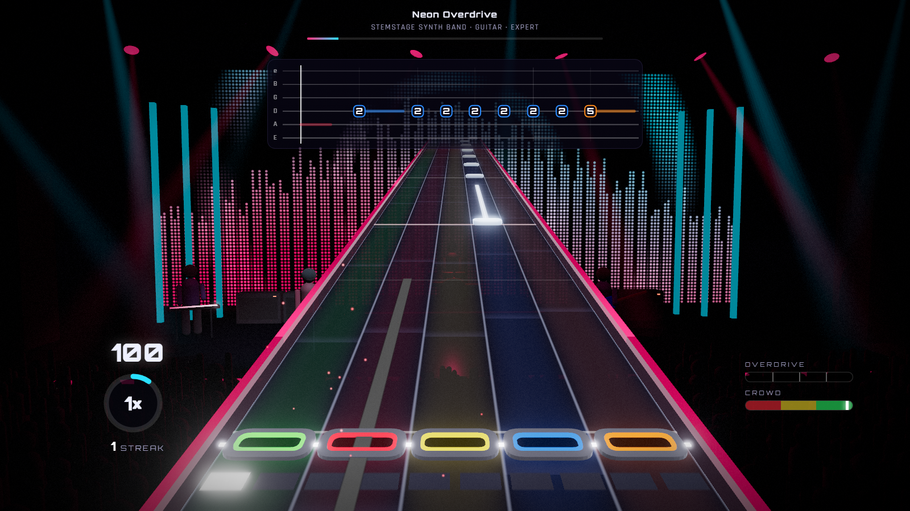
  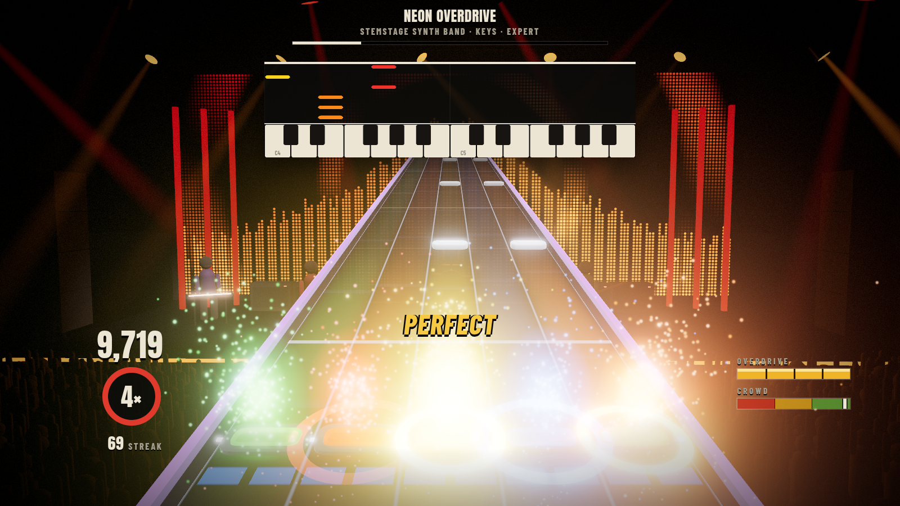
</p>

<p align="center">
  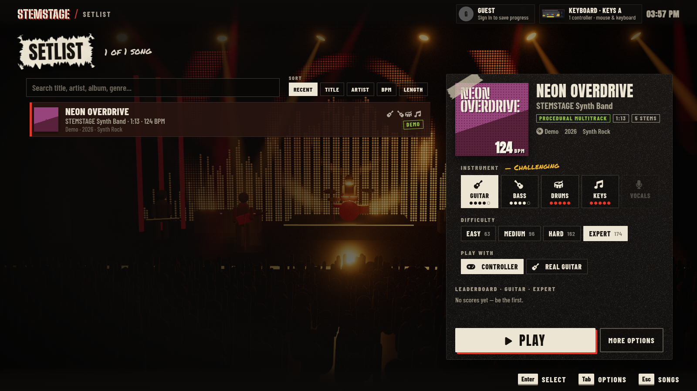
  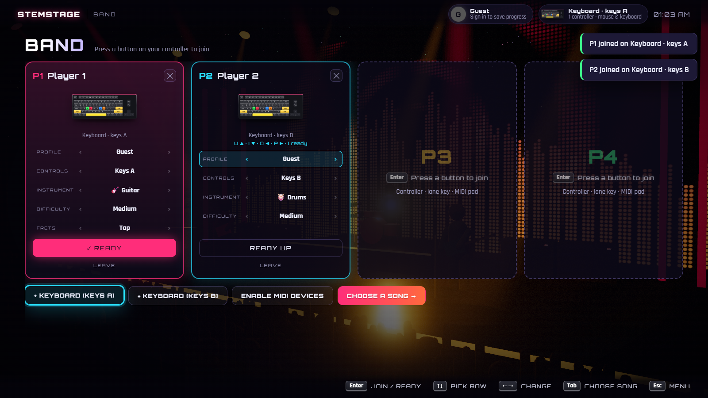
  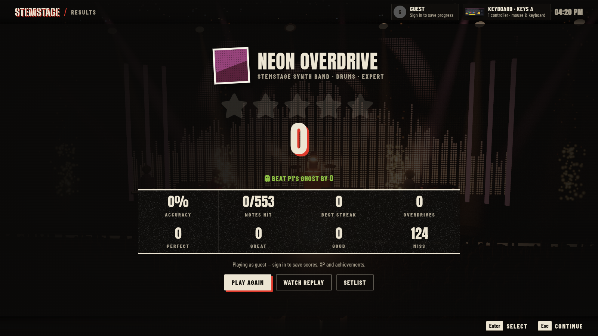
</p>

## Getting started

### Requirements

| | |
|---|---|
| OS | Windows 10 / 11, or Linux x86-64 (AppImage / .deb / .rpm) |
| Node.js | 20 or newer — runs the game server |
| GPU | Any WebGL 2 GPU. An NVIDIA GPU makes AI splitting ~10× faster (CPU works too) |
| For building the app | [Rust](https://rustup.rs) + Visual Studio Build Tools (C++), WebView2 (preinstalled on Windows 11). Linux: WebKitGTK 4.1 dev packages (see the [wiki](https://github.com/SylarBeck/STEMSTAGE/wiki/Development-Setup)) |

### Install

**Players:** download `STEMSTAGE_x.y.z_x64-setup.exe` (Windows) or the `.AppImage` / `.deb` / `.rpm` (Linux) from [Releases](https://github.com/SylarBeck/STEMSTAGE/releases/latest) and run it (the Windows installer installs for your user, no admin needed). On Linux, run `bash server/setup-ai.sh` from a source checkout for the AI splitter and DualSense bridge; see the [wiki](https://github.com/SylarBeck/STEMSTAGE/wiki/Installation). Install [Node.js](https://nodejs.org) 20+ if you don't have it, and run `npm run ai:setup` from a source checkout once if you want the AI splitter (see below). The app updates itself when a new release is published.

**From source:**

```bash
git clone <this repo> STEMSTAGE
cd STEMSTAGE
npm install
npm run ai:setup        # Python env with Demucs, basic-pitch and the DualSense bridge (uses uv)
npm run desktop:build   # builds the desktop app and its installer
```

The installer lands in `src-tauri/target/release/bundle/nsis/`. Run it, then start **STEMSTAGE** from the Start menu or desktop. The app starts the game server, the AI splitter and the controller bridge for you and opens fullscreen (F11 / Alt+Enter toggles).

### Play in a browser instead

Double-click **`play.bat`** (or `npm run dev` + `npm run ai` + `npm run bridge`) and open <http://127.0.0.1:5173>. MIDI devices need Chrome or Edge.

## Controllers

| Device | Notes |
|---|---|
| **DualSense / DualSense Edge** | Read natively by the controller bridge (pydualsense): adaptive triggers, haptics, lightbar, player LEDs, touchpad, battery. USB or Bluetooth |
| Xbox, DualShock 4, Switch Pro, Joy-Con, generic pads | Gamepad API, standard layout. Rumble where the browser supports it |
| Rock Band / Guitar Hero (Xbox 360) | Pick the **Guitar** or **Drum kit** profile: frets, strum bar, whammy, tilt, kick pedal |
| Non-standard pads (PS3 instruments, arcade sticks) | **Map buttons** once with the built-in wizard |
| MIDI e-drums and keyboards | General MIDI drum map; keyboard C–G = lanes. Rock Band 3 MIDI Pro Adapter works |
| Keyboard | Two layouts so two people can share one: `D F Space J K` and `U I O P [` |

**Config profiles** — every device uses a profile: the presets, or your own named copies (rename, reset, delete). A profile holds bindings for 5-lane and drums plus options: strum mode, lefty flip, trigger press point, whammy source (right stick, left stick, DualSense touchpad), haptics and adaptive triggers on/off. Profiles are remembered per controller and can be switched from a band slot.

### Menu buttons

| | PlayStation | Xbox | Keyboard |
|---|---|---|---|
| Select / back | ✕ / ◯ | A / B | Enter / Esc |
| Options (song menu, profiles) | △ | Y | Tab |
| Search | ▢ | X | F |
| Tabs · instrument | L1 / R1 | LB / RB | Q / E |
| Difficulty · page | L2 / R2 | LT / RT | PgUp / PgDn |
| Play now | Options | Menu | — |

In the **band lobby** each player sets up their own slot with their own controller; ✕ readies up, ◯ goes back to the menu, the Leave row removes a player.

## Playing online

1. The host opens **Online → Host online**. After a few seconds an invite code appears, for example `POTTER-SIMON-FLORAL-EDGES`. Press **Copy invite** and send it to your friends.
2. Friends open **Online → Join**, type the code (spaces or dashes, any case) and press **Join**.
3. The host picks a song. Friends who don't have it download it from the host automatically, then everyone readies up and the host starts the match.

No router setup is needed. The room runs through a free [Cloudflare quick tunnel](https://developers.cloudflare.com/cloudflare-one/connections/connect-networks/do-more-with-tunnels/trycloudflare/): the game downloads `cloudflared` once (~55 MB, into `%LOCALAPPDATA%\stemstage\bin`) and only makes outgoing connections, so there is no port forwarding and no firewall prompt. Each room gets a new code, and the room closes when the host stops hosting or quits.

**Local network** hosts on your Wi-Fi/LAN only (port 5180); friends type the address it shows instead of a code.

Songs are sent as Opus (ffmpeg) or Ogg Vorbis (the AI environment), about 20 MB instead of 250 MB for a 4-minute song, and decoded back to sample-aligned stems on the friend's side.

## How it works

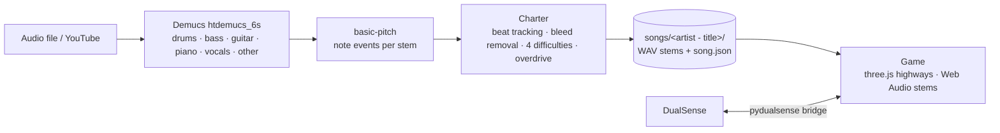

The desktop app is a small [Tauri](https://tauri.app) launcher. It starts:

| Service | Port | What |
|---|---|---|
| Game server (`server/app.js`, Node) | 5173 | Serves the game and the song library, yt-dlp, metadata, profiles and online rooms (5180, reached through a Cloudflare tunnel) |
| AI splitter (`server/stem_server.py`) | 8765 | Demucs + basic-pitch on CUDA or CPU |
| Controller bridge (`server/controller_bridge.py`) | 8766 | DualSense input/output over WebSocket via pydualsense |

Songs live in `Documents\STEMSTAGE\songs` (one folder of WAV stems + `song.json` per song), profiles and scores in `Documents\STEMSTAGE\data`, logs in `%LOCALAPPDATA%\stemstage\logs`.

## Scripts

| Command | |
|---|---|
| `npm run dev` | Game in a browser with hot reload (Vite) |
| `npm run build` / `npm start` | Build the game / serve the build with the production server |
| `npm run ai:setup` / `npm run ai` | Install / start the AI splitter |
| `npm run bridge` | Start the DualSense controller bridge |
| `npm run desktop:dev` / `npm run desktop:build` | Run / package the desktop app (signs update files when the updater key exists) |
| `npm run art` / `npm run brand` | Re-render the controller pictures / brand images |
| `npm run screenshots` | Capture the README screenshots |

## Releases and updates

The desktop app checks GitHub Releases for a newer version at start-up (Settings → Updates) and installs it after asking. Updates are signed; the app refuses files that don't match the public key in `src-tauri/tauri.conf.json`.

1. Once: put the repository on GitHub and add a secret **TAURI_SIGNING_PRIVATE_KEY** with the contents of `%USERPROFILE%\.tauri\stemstage.key` (keep this file private and backed up — without it you can't publish updates for installed copies).
2. For each release: bump the version in `package.json`, `src-tauri/tauri.conf.json` and `src-tauri/Cargo.toml`, commit, then tag and push: `git tag v1.4.0 && git push origin v1.4.0`.
3. The **Release** workflow (`.github/workflows/release.yml`) builds the Windows installer and the Linux AppImage, .deb and .rpm, signs the update files and publishes them in one release with `latest.json` (details: [Release Process](https://github.com/SylarBeck/STEMSTAGE/wiki/Release-Process)). Builds made there know their repository, so installed copies find updates by themselves; copies built on your PC use the repository set in Settings → Updates.

## Singing and lyrics

Choose **🎤 Sing** on the vocals part (or Settings → Singing), pick your microphone and try *Test microphone*. Lyrics come from [faster-whisper](https://github.com/SYSTRAN/faster-whisper) listening to the separated vocal stem: new imports get them automatically, older songs through Song options → *Get lyrics (AI)*. The Whisper "small" model (~480 MB) downloads on first use. *Guide vocals* keeps the original singer in the mix; off it's karaoke.

## Project layout

```
src/game/        renderer (post FX), stage, highway, session (band + online), player, vocals (singing), replays
src/audio/       engine, import pipeline, charter, transcription attribution, time-stretch
src/input/       input routing, config profiles (bindings.js), DualSense bridge client
src/ui/          menus + spatial navigation, controllers hub, controller art, tour, setlists, chart editor, stream, updates, HUD
server/          game server, song library, yt-dlp + metadata, online rooms + tunnel, stream relay (Twitch), AI splitter + lyrics, controller bridge
src-tauri/       desktop launcher (Rust) · desktop/splash/  startup screen
brand/           logo, icon, wordmark, banner · tools/  art, brand and screenshot scripts
```

## Troubleshooting

- **DualSense not detected** — turn it on (or plug it in), then close Steam or DS4Windows or turn off their PlayStation support; they can take over the controller. Settings → Controllers → *Test controller bridge* shows what the bridge sees.
- **"Controller bridge offline"** — run `npm run ai:setup` once; the app starts the bridge automatically after that.
- **The desktop app shows an error on start** — it needs Node.js on your PATH. Logs are in `%LOCALAPPDATA%\stemstage\logs`.
- **Online: "No room found"** — check the code with the host; a room only exists while the host is on the Online screen or in the match. A brand-new room can take a few seconds to become reachable.
- **Online: the invite code never appears** — the tunnel needs internet access to github.com (first time only) and to Cloudflare. If a VPN or firewall blocks it, use *Local network* or put `cloudflared.exe` in `%LOCALAPPDATA%\stemstage\bin` yourself.
- **Singing / real instruments: no microphone** — the desktop app grants the game microphone access itself; if Windows still blocks it, turn on Settings → Privacy & security → Microphone → *Let desktop apps access your microphone*. Then Settings → Singing → *Microphone* and *Test microphone*.
- **More help** — the [wiki](https://github.com/SylarBeck/STEMSTAGE/wiki/Troubleshooting) covers Linux, Discord, lyrics and more.
- **Stream: chat commands do nothing** — Stream screen → connect to your channel name (no login needed); it shows "Reading chat" when connected.
- **Local network: friends can't join** — allow Node.js through Windows Firewall on private networks and share the address shown on the Online screen (port 5180).

## Credits

three.js · Tauri · Demucs (Meta) · basic-pitch (Spotify) · faster-whisper / Whisper (OpenAI) · [LRCLIB](https://lrclib.net) (lyrics) · [Lanyard](https://github.com/Phineas/lanyard) (Discord status) · pydualsense · hidapi · yt-dlp · music-metadata · Cloudflare Tunnel · Orbitron and Rajdhani fonts (SIL Open Font License). Controller pictures for gamepads come from the [Gamepad Asset Pack](https://github.com/AL2009man/Gamepad-Asset-Pack) by AL2009man (MIT, see `public/controllers/pack/LICENSE.txt`); guitar, drum, MIDI and keyboard pictures are original artwork. Icons are [Font Awesome Free](https://fontawesome.com) (icons CC BY 4.0, fonts SIL OFL 1.1, bundled in `public/vendor/fontawesome`). Product names and trademarks belong to their owners. Only import music you have the rights to use.

## License

[MIT](LICENSE) © SylarBeck. Third-party assets keep their own licenses (see Credits).
